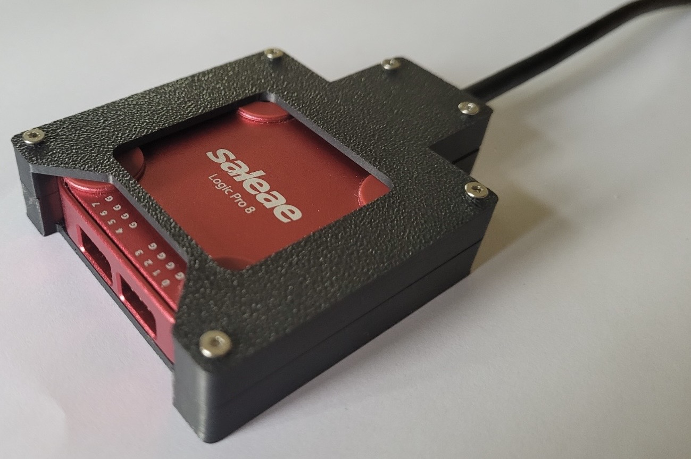
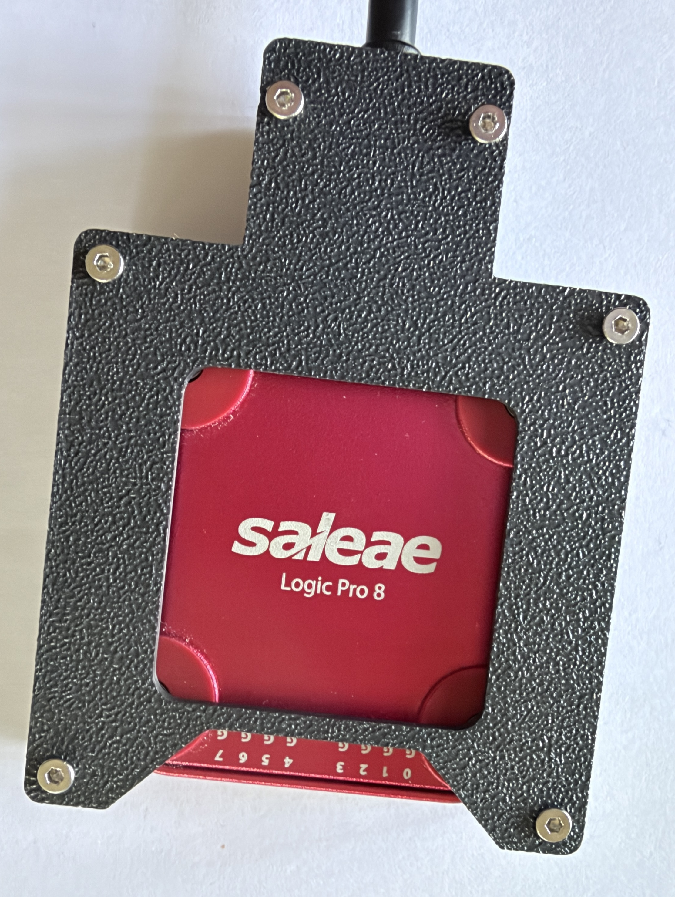
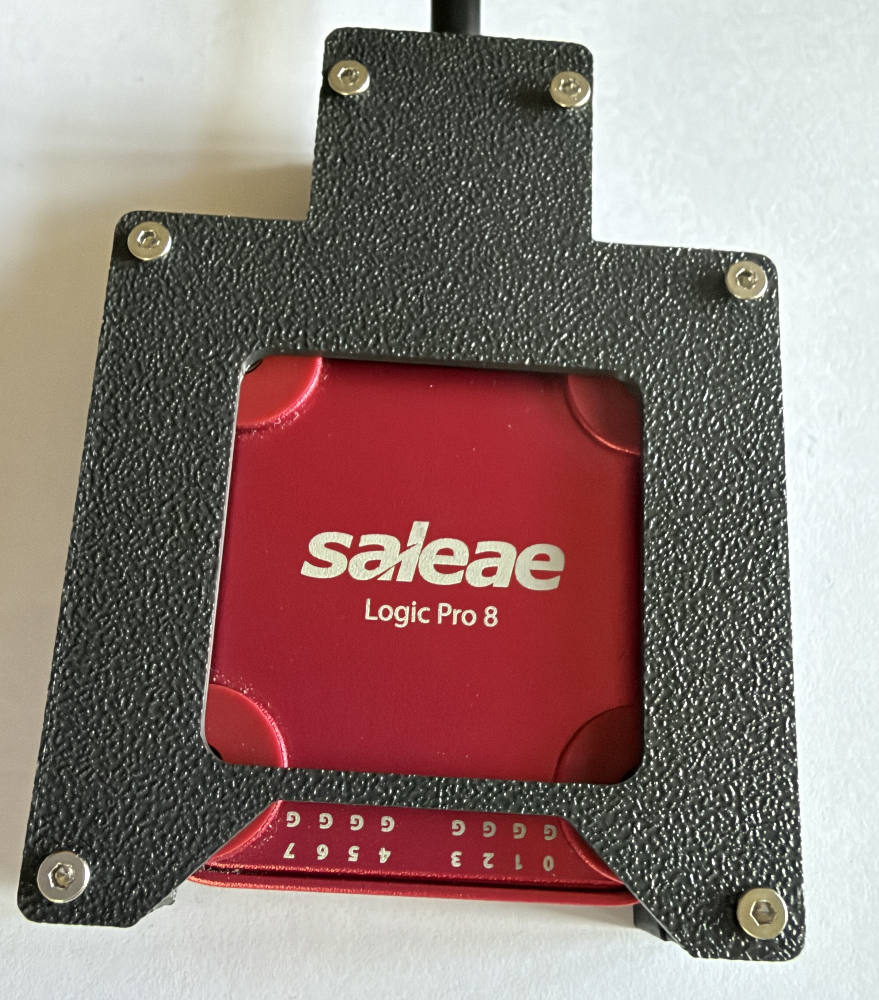
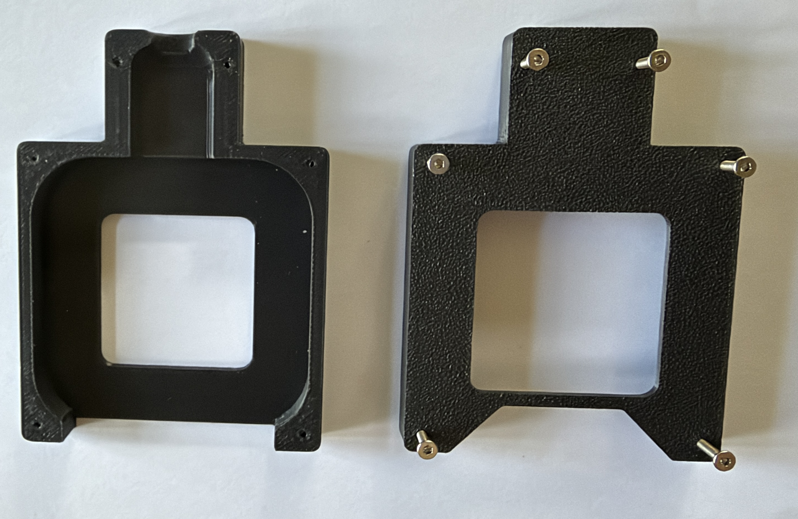
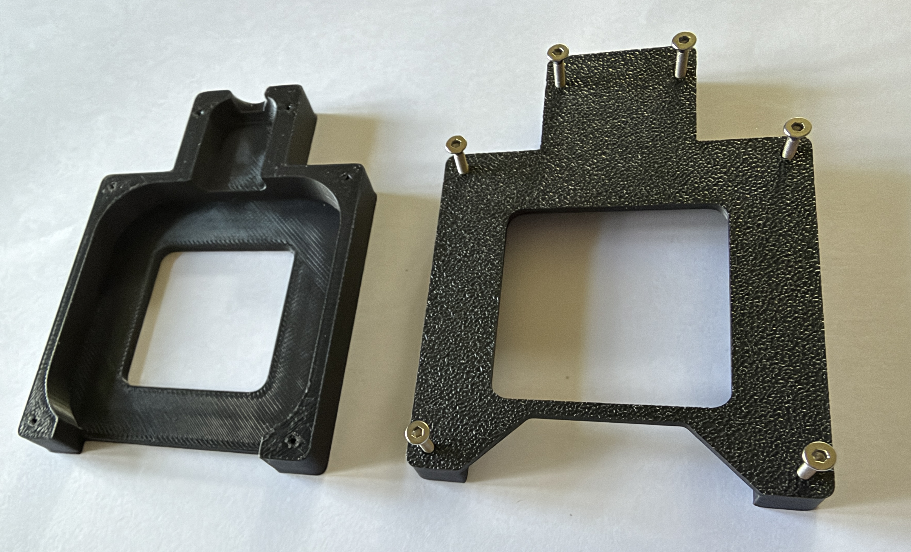
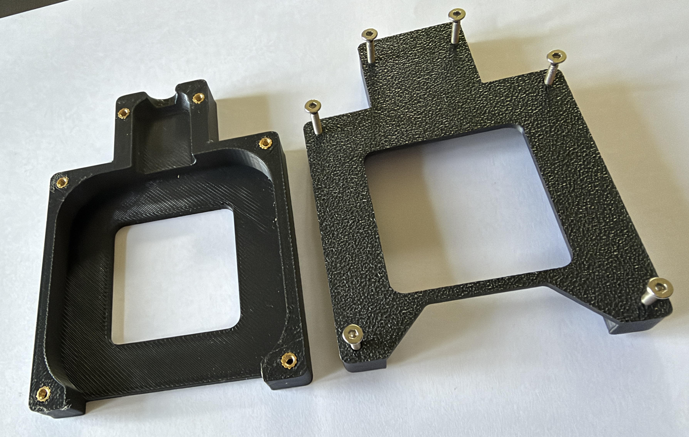
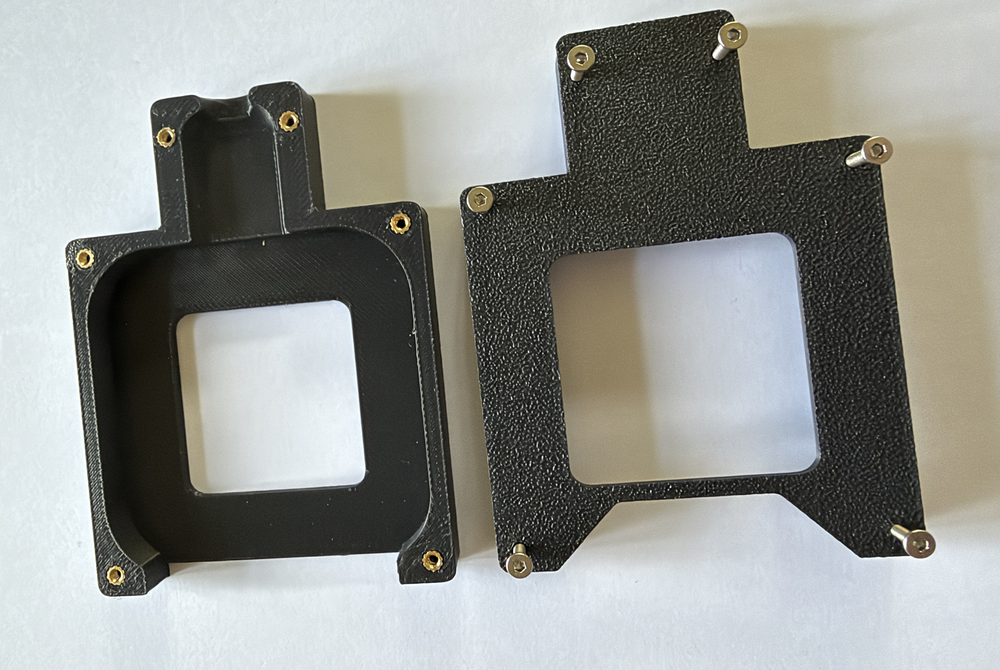
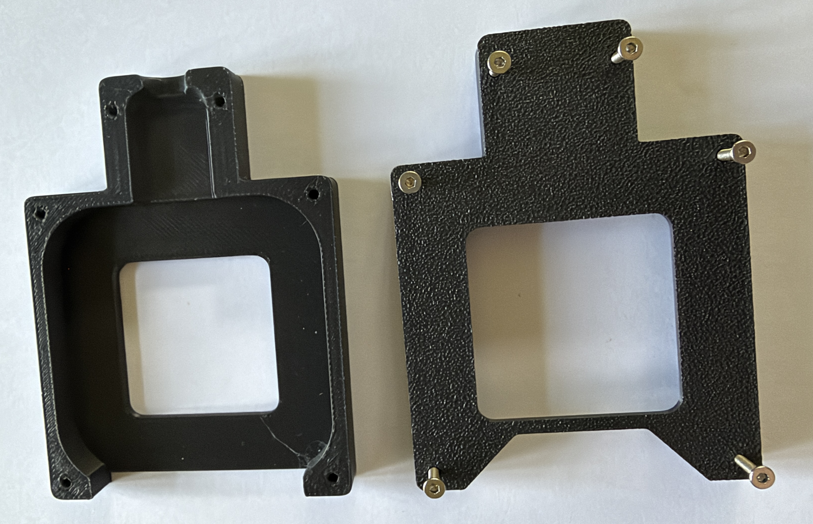
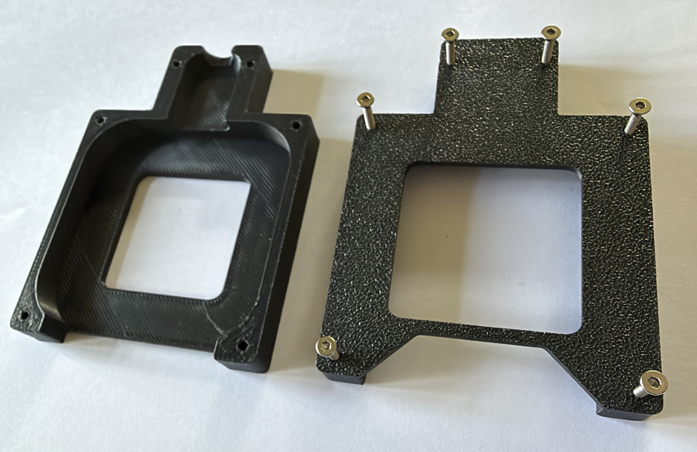
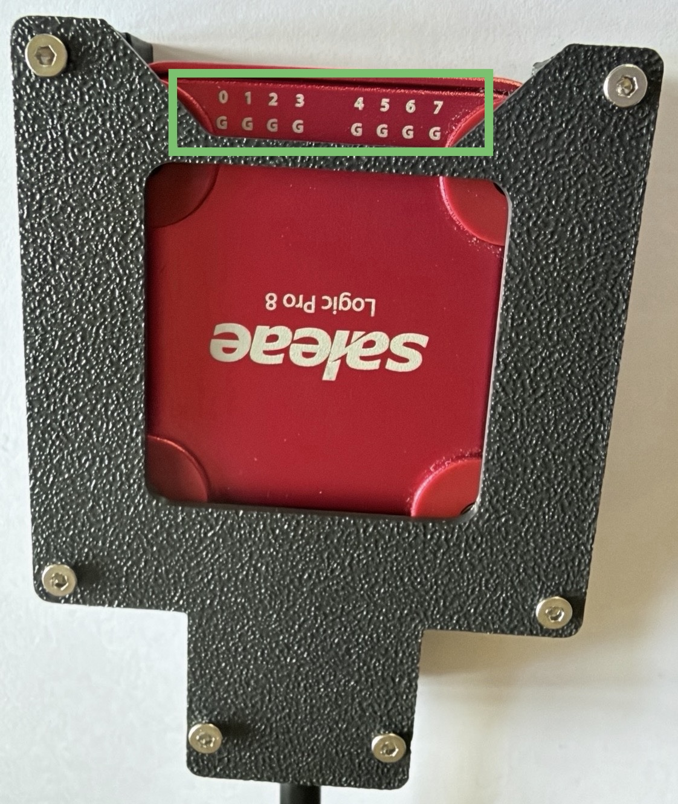

# Saleae Logic Pro 8 USB Lock Case

**USB disconnects mid-capture? Not anymore.** 🔒

My friend **Jorge Valencia** forked [nemanjan00/saleae-case](https://github.com/nemanjan00/saleae-case) and designed a USB lock case for the **Saleae Logic Pro 8**: a 3D-printable, two-part enclosure that locks the USB plug in place, so a tug on the cable can no longer cut a capture short.

  <a href="https://github.com/therealdreg/saleae-8-case-usb-lock/raw/main/stuff/saelae_case.zip"><b>⬇️ Download all the print files (ZIP, 17 MB)</b></a>
   
  Also on <a href="https://makerworld.com/en/models/3377887-saleae-logic-pro-8-usb-lock-case#profileId-3842770">MakerWorld</a> and <a href="https://www.thingiverse.com/thing:7416751">Thingiverse</a>

https://discuss.saleae.com/t/saleae-logic-pro-8-usb-lock-case/3818

## How it works

- The case has two parts, a bottom shell and a top plate, and the split runs right through the center of the USB plug.
- The plug sits in a closed shroud at the back of the case. The shroud's end wall only lets the cable through, so pulling or wiggling the cable can't work the plug out of the port.
- Six M2 screws hold everything together: four at the corners and two on the USB shroud.
- The probe headers stay fully accessible at the front, and the Saleae logo shows through the top window.
- Assembled size: about 61 × 83 × 17 mm.

> [!IMPORTANT]
> The case is designed for the **original USB cable that ships with the Logic Pro 8**. Other cables can have a differently sized or shaped plug, so they may not fit or may not lock in place.

## What's new in this fork

Compared with the original [nemanjan00/saleae-case](https://github.com/nemanjan00/saleae-case), this fork opens up the front of the case and adds more ways to screw it together:

- **Channel numbers in plain view:** the top plate is cut back over the probe headers, so the numbers printed next to them (0–7 and G) stay visible and you can see at a glance which pin is which.
- **Easier wiring:** the front wall is gone, which leaves room for your fingers around the headers, so Dupont jumper wires are easier to grip and push in.
- **Three screw options:** besides the original self-tapping screws, you can use brass heat-set inserts or regular machine screws (see [the three variants](#the-three-variants)).

  
  
   
  <em>The open front: channel numbers in plain view and room to plug in Dupont wires.</em>

## Download

- **This repository:** [ZIP with all the print files](https://github.com/therealdreg/saleae-8-case-usb-lock/raw/main/stuff/saelae_case.zip) (17 MB)
- **MakerWorld:** [makerworld.com/en/models/3377887](https://makerworld.com/en/models/3377887-saleae-logic-pro-8-usb-lock-case#profileId-3842770)
- **Thingiverse:** [thingiverse.com/thing:7416751](https://www.thingiverse.com/thing:7416751)

The ZIP from this repository contains:

| File | What it is |
| --- | --- |
| `saleae_case.stl` | Variant 1: pointed self-tapping screws |
| `saleae_case_v2.stl` | Variant 2: brass heat-set inserts |
| `saleae_case_v3.stl` | Variant 3: flat-tip screws |
| `saleae_case.3mf` | Bambu Studio project with all three variants (one per plate) and the print settings |

Each STL holds both parts (bottom shell and top plate), already laid out flat and ready to slice. You only need to print **one** of them.

## The three variants

All three variants are the same case: same shape, same top plate, and six M2 × 12 mm screws in the same places. The **only** difference is how the screws grip the bottom shell, so pick the one that matches the screws you have.

| | [Variant 1](#variant-1-pointed-self-tapping-screws) | [Variant 2](#variant-2-brass-heat-set-inserts) | [Variant 3](#variant-3-flat-tip-screws) |
| --- | --- | --- | --- |
| **File** | `saleae_case.stl` | `saleae_case_v2.stl` | `saleae_case_v3.stl` |
| **Plate in the 3MF** | 1 | 2 | 3 |
| **Screws (6 ×)** | M2 × 12 mm pointed self-tapping screws | M2 × 12 mm machine screws | M2 × 12 mm machine screws (flat tip) |
| **Extra parts** | None | 6 × M2 brass heat-set inserts | None |
| **Tools** | Screwdriver | Screwdriver + soldering iron | Screwdriver |
| **Holes in the bottom shell** | Ø1.6 mm pilot holes, closed underneath | Ø3.2 mm pockets for the inserts, closed underneath | Ø2.3 mm holes, open underneath |
| **The screws grip** | The plastic | The brass inserts | The plastic |
| **Pick it if** | You have self-tapping screws for plastic | You want metal threads or will open the case often | You have regular M2 machine screws but no inserts |

In the photos below, the bottom shell is on the left and the textured top plate, with its six screws in place, is on the right.

### Variant 1: pointed self-tapping screws

  
  

Pointed self-tapping screws cut their own thread into Ø1.6 mm pilot holes. No extra parts are needed, and the holes don't go all the way through, so the underside stays closed. This is the same screw setup as the original nemanjan00 design. Plastic threads wear a little every time you reopen the case and strip if you overtighten them, so go gently.

### Variant 2: brass heat-set inserts

  
  

The sturdiest option. Six M2 brass inserts are melted into Ø3.2 mm pockets in the bottom shell, and regular M2 machine screws thread into brass instead of plastic. It takes a soldering iron and a few extra minutes, but you can open and close the case as many times as you need without wearing out the threads.

### Variant 3: flat-tip screws

  
  

The same regular M2 machine screws as variant 2, but without inserts. The bottom shell has wider Ø2.3 mm holes that go all the way through, so you can see them on the underside. The screws grip the plastic directly, so don't overtighten them.

## What you need

- A Saleae Logic Pro 8 and **the original USB cable** that came with it
- The printed bottom shell and top plate (both come in the STL of your variant)
- **6 × M2 × 12 mm screws** of the type your variant needs (see the table above): four for the corners and two for the USB shroud
- **Variant 2 only:** 6 × M2 brass heat-set inserts that fit a Ø3.2 mm hole, and a soldering iron to set them
- A screwdriver or hex key that fits your screws

Any M2 head style works: the top plate has plain Ø2.3 mm holes with no countersink, so the heads simply sit on top. The case in the photos uses countersunk hex-socket screws.

## Printing

Settings from the included 3MF, sliced for a Bambu Lab A1:

| Setting | Value |
| --- | --- |
| Material | PLA |
| Nozzle | 0.4 mm |
| Layer height | 0.2 mm |
| Walls | 2 |
| Top / bottom layers | 5 / 3 |
| Infill | 15% (grid) |
| Supports | None |
| Build plate | Textured PEI |

Both parts are already oriented for printing and need no supports. The top plate prints upside down, with its outer face on the bed, which is where the textured finish in the photos comes from. On other printers, slice the STL for your variant with similar settings.

## Assembly

1. Print both parts of your variant.
2. **Variant 2 only:** set the six brass inserts. Place each insert on its pocket, press it straight down with a soldering iron until it sits flush with the surface, and let it cool.
3. Plug the original USB cable into the Logic Pro 8.
4. Lay the device in the bottom shell with the Saleae logo facing up and the channel numbers (0–7 and G) at the front opening. The plug goes in the shroud channel, and the cable leaves through the notch at the back.
5. Put the top plate on, textured side up.
6. **Check that the channel numbers show through the cut-out at the front of the top plate**, as in the photo below. If you can't see them there, the Logic Pro 8 is facing the wrong way: take it out and turn it so the numbers face up at the front.
7. Fit the six M2 × 12 mm screws, four at the corners and two on the shroud, and tighten them evenly until snug. Don't overtighten them, especially with variants 1 and 3, where the screws grip the plastic.

  
   
  <em>Installed correctly: the channel numbers (0–7 and G) show through the front cut-out.</em>

## License

Released under the [MIT License](LICENSE).
